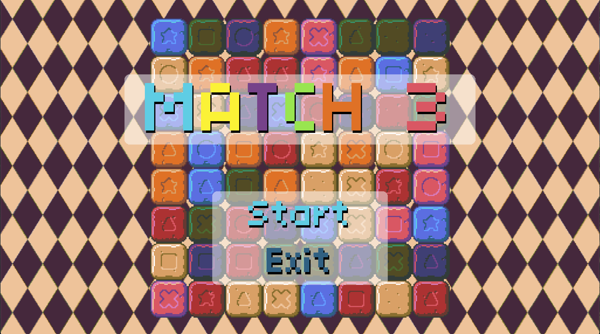
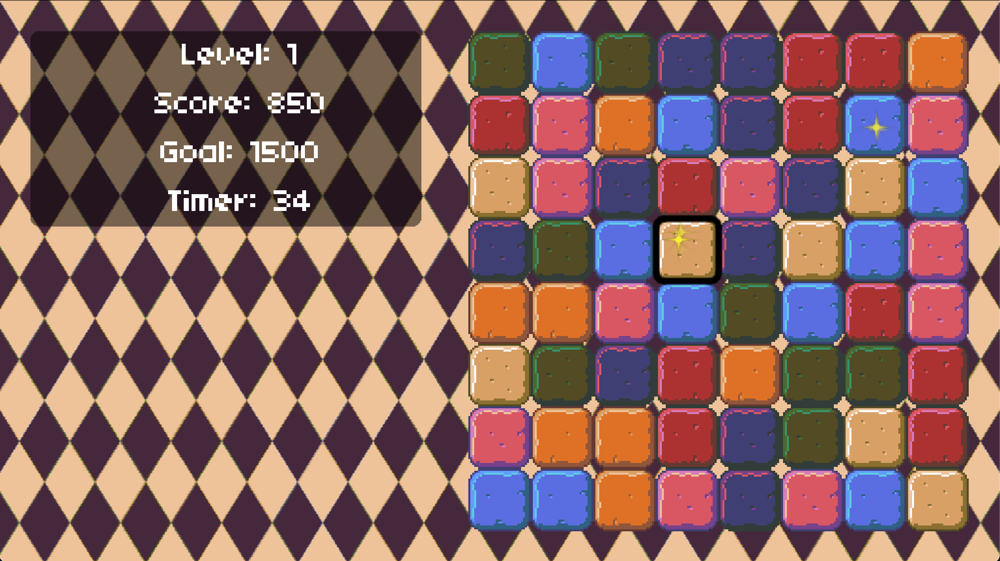

## Match 3

Pour la quatrième  semaine de la formation GD50 de l'université Harvard, l'objectif était de recréer le jeu Match 3 avec le moteur de jeu LÖVE2D et le language de programmation Lua

Les sujets abordés sont les suivants:

- Les feuilles de Sprites et les Quads
- Disposition procédurale des briques
- Gestion avancée des états
- Niveaux de jeu
- Santé du joueur
- Système de particules
- Détection de collision avancée
- Données de sauvegarde persistante

Pour y jouer, vous devez tout d'abord télécharger le moteur LÖVE2D disponible ci-dessous:

https://love2d.org/#download

Vous pouvez maintenant télécharger et lancer le fichier du jeu "Match3.love".

